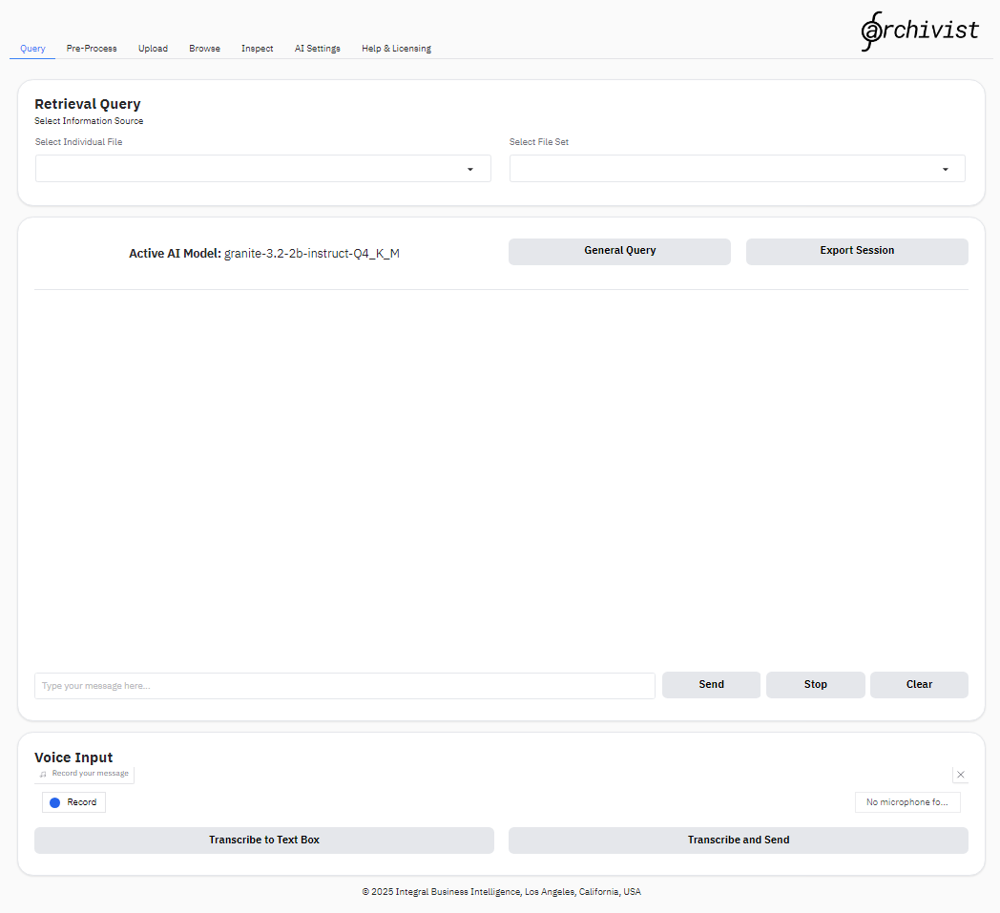
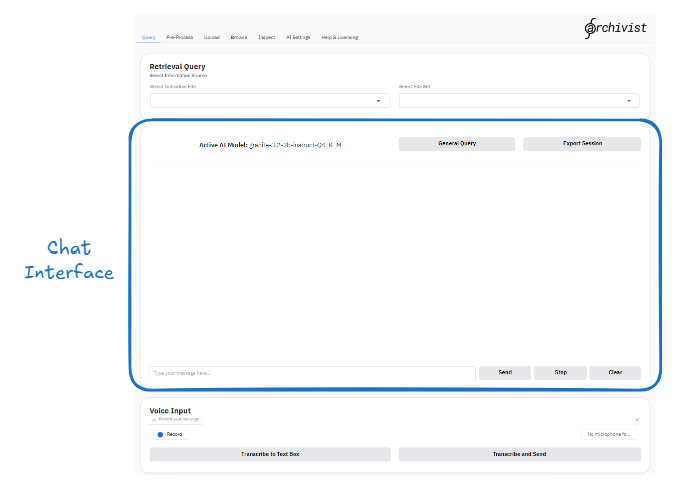
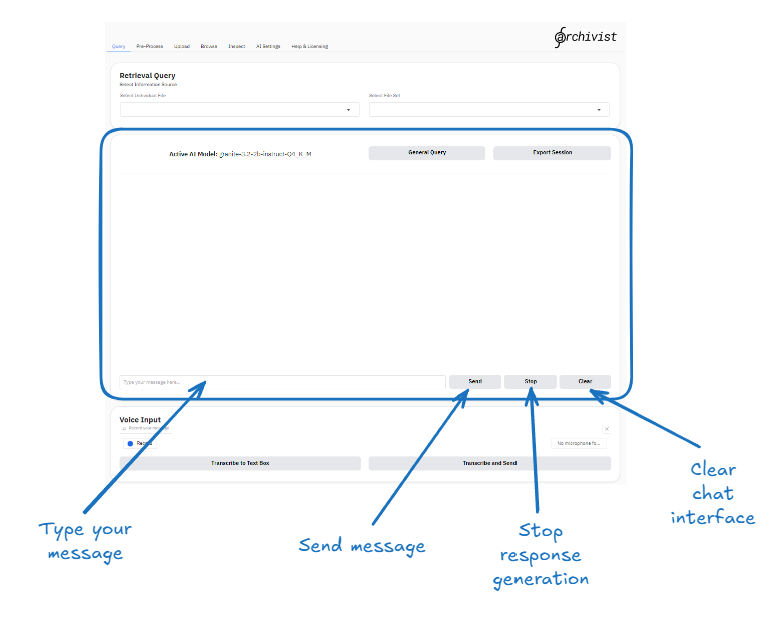

1\. Open Archivist. The application will open to the Query tab - which looks like this:

   

2\. Scroll down to the chat interface:

   

3\. Type in your message and click send:

   

4\. The hourglass icon in the message input box indicates that the model is processing your request. Once the model has finished, it will display the response in the chat interface:

   

5\. The AI model will respond with a message. You can continue the conversation by typing in the message input box and clicking send again:

   

**That's it! You can now use the chat interface to interact with the AI model running on your own computer. You can ask questions, request information, or have a conversation. No data leaves your device, no chat history is stored, there are no limits on the number of messages you can send, and there are no subscription fees!**